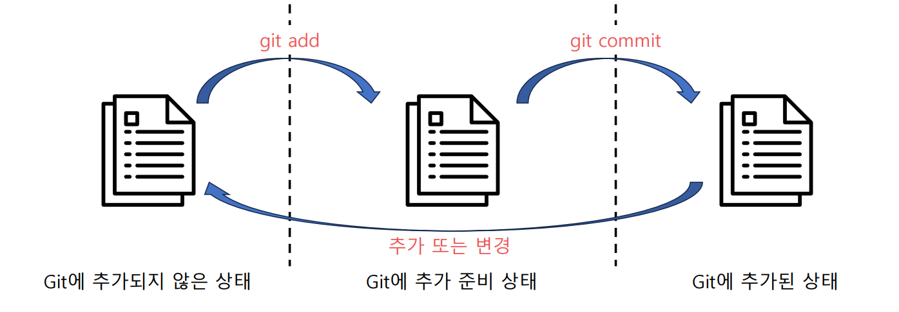

# Git & GitHub 기초

## Git 설치 후 사전 설정

Git을 설치 후에는 자신이 누군지 설정해야 한다.
```
git config --global user.email "사용자 이메일"
git config --global user.name "사용자 이름"
```

## Git 버전 관리 시작

1. GitBash 혹은 터미널에서 관리하고자 하는 프로젝트 폴더까지 이동한다.  
2. `git init` 명령어를 통해 현재 프로젝트 폴더를 Git으로 관리할 것임을 명시한다.

## Git의 파일 관리 절차


- `git status` 명령어를 통해 어떤 파일이 추가되거나 변경되었는지 확인할 수있다.
- `git add <파일명>` 명령어를 통해 추가되거나 변경된 파일을 commit 대상으로 지정한다.
- `git add -all` 모든 추가되거나 변경된 파일을 commit 대상으로 지정한다.
- `git commit -m "commit message"` commit 대상으로 지정된 파일들의 변경점을 최종적으로 git에 기록한다.


## Git에서 관리하지 않을 파일 지정

- `.gitignore` 파일을 생성해 파일에 관리하지 않을 파일명들을 입력한다.


## 파일 기록을 취소하는 방법

1. `git add` 진행 전일 경우
    - `git restore <파일 이름>` 
2. `git add` 까지만 이루어지고 commit 되지는 않은 경우
    - `git restore --staged <파일 이름>` 으로 add를 취소하는 것이 가능하다.
3. `git commit` 까지 이루어진 경우
    - `git reset HEAD^` `git reset HEAD^^` 을 이용해 한 단계 혹은 두 단계 까지 commit을 취소하는 것이 가능하다.
    - `git reset HEAD~<숫자>` 을 이용해 원하는 단계 만큼 commit을 취소하는 것이 가능하다
    - `git log` 를 사용하면 지금까지 저장된 commit들의 해시번호들이 나타나는데 `git reset <해시코드 앞 6자리>` 를 이용해 원하는 단계의 commit으로 복구 가능하다.
 

## SSH를 통한 GitHub Pull & Push

